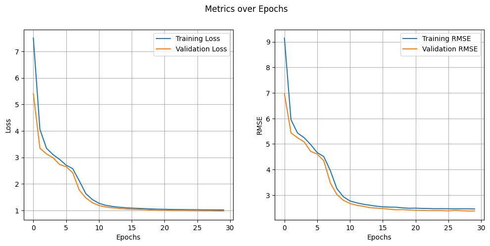
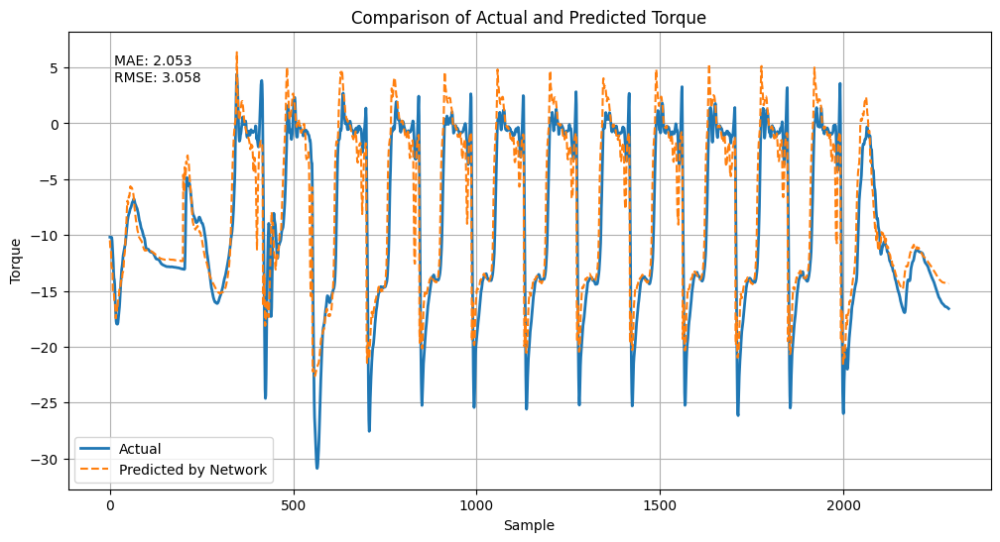

# Test task from Sber Robotics Lab

## Actuator Network

This project was created as part of an internship at the Sberbank Robotics Center. The main goal of the project was to develop an algorithm for learning and calculating metrics using a network of actuators from a scientific article. 

### Overview

Before starting work, a study was conducted on the scientific article "Learning Agile and Dynamic Motor Skills for Legged Robots", which proposes a RL algorithm for a ANYmal quadrupedal robot from ETH Zurich. 

### Algorithm

Based on the materials studied, an algorithm was developed using deep learning and a network of actuators to train a walking robot. During the development process, special attention was paid to data preprocessing, model training and calculation of performance metrics.

### Conclusion

The algorithm was tested on a dataset from the repository [anymal_science_robotics_supplementary](https://github.com/junja94/anymal_science_robotics_supplementary). The experimental results are presented in the form of graphs comparing the performance of the algorithm with real data.

After roughly 15 epochs, model starts to overfit. Incorporating regularization methods like dropout or L2 regularization can help prevent this issue and enhance generalization.

In conclusion, the MAE = 2 and RMSE = 3 metrics suggest some prediction errors in the model. While improvements like hyperparameter tuning or dataset augmentation are options, leveraging robust control methods is recommended. These methods ensure stable system control despite inaccuracies, enhancing performance and reliability in real-world scenarios.

- `model/`: Folder with trained model
- `src/`: Source code folder
  - `actuator_network.py `: Code of the network of actuators
  - `data_preprocessing.py `: Code for data preprocessing
  - `evaluation.py `: Code for evaluating the performance of the algorithm
  - `metrics.py `: Code for calculating metrics
  - `training.py `: Code for training the model
- `README.md `: This file

